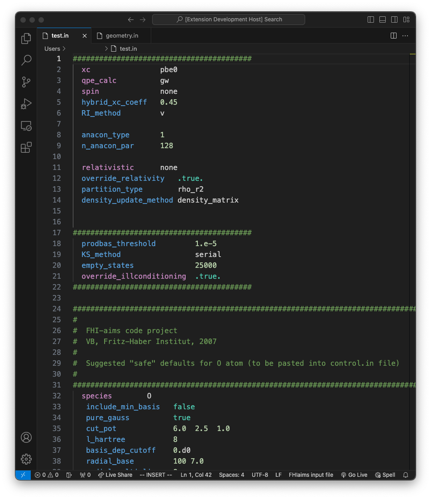
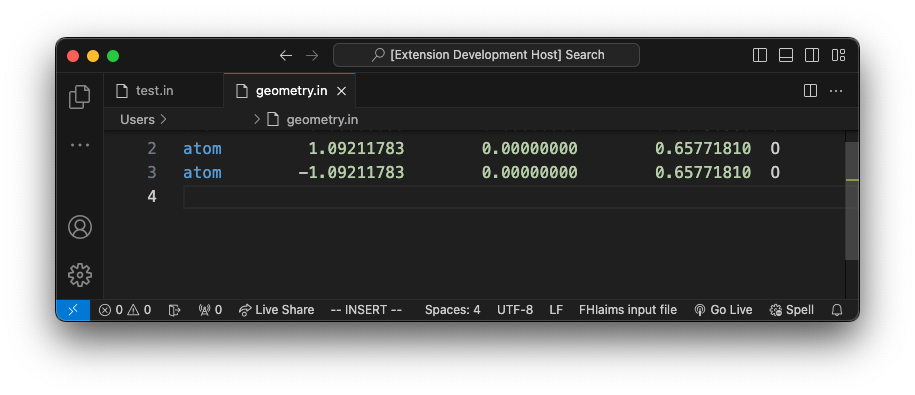

# FHIaims-syntax highlighting 

FHIaims syntax highlighting for `control.in` and `geometry.in` files in VS Code.

This extension is not officially released by FHIaims.

## Features
Simple syntax highlighting like:

## Known Issues

Spell checking of the keywords is not supported so far (but planned). Up to know the first word in every line is just highlighted independent of the right spelling. 

## Install 

To start using your extension with Visual Studio Code copy it into the `<user home>/.vscode/extensions` folder and restart Code.

